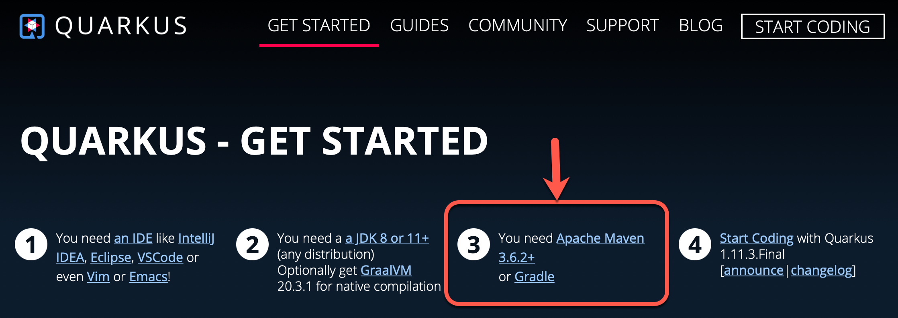
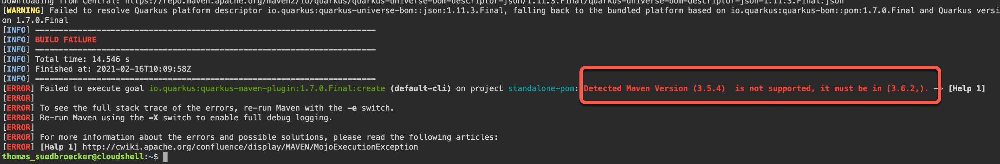

# Known Issues

### (2021/02/16) Quarkus needs Apache Maven 3.6.2+, which is not included in IBM Cloud Shell

Thanks to Sbusiso Mkhombe, because he pointed this out.

* Information in [Quarkus](https://quarkus.io/get-started/)

* Problem in IBM Cloud Shell

To run the development exercises, you need to setup following tools on your machine:

* [git](https://git-scm.com/book/en/v2/Getting-Started-Installing-Git)
* [curl](https://curl.haxx.se/download.html)
* [oc](https://docs.openshift.com/container-platform/4.3/welcome/index.html)
* [mvn](https://maven.apache.org/ref/3.6.3/maven-embedder/cli.html)
* Java 9 or higher

or check out this [Docker image](https://hub.docker.com/r/tsuedbroecker/cns-workshop-tools).