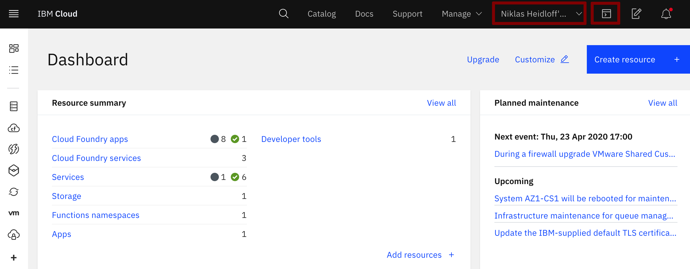
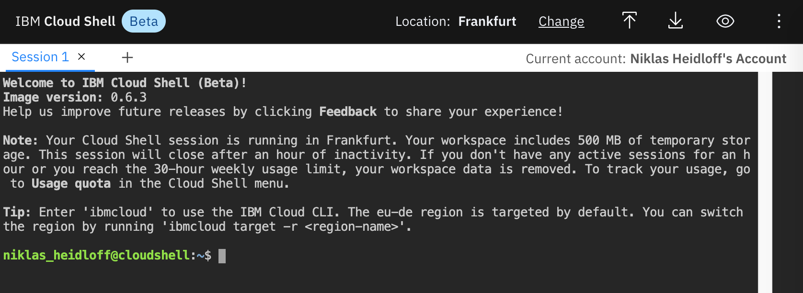
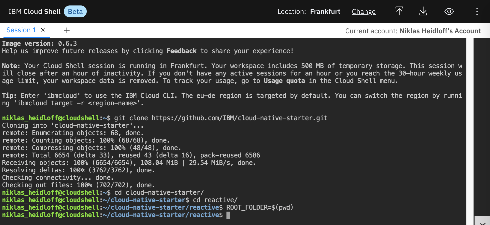
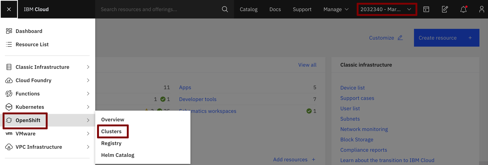
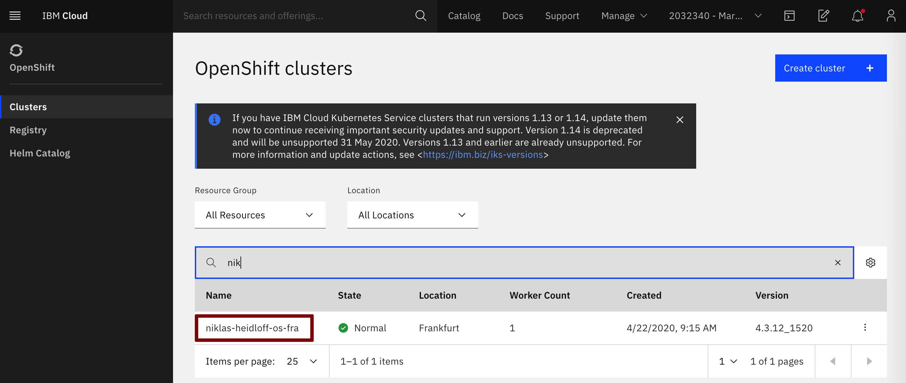
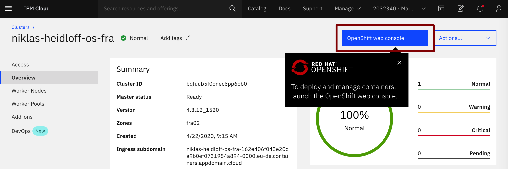
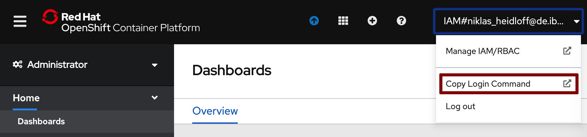
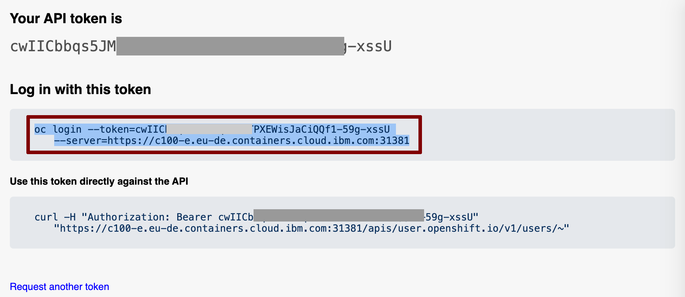
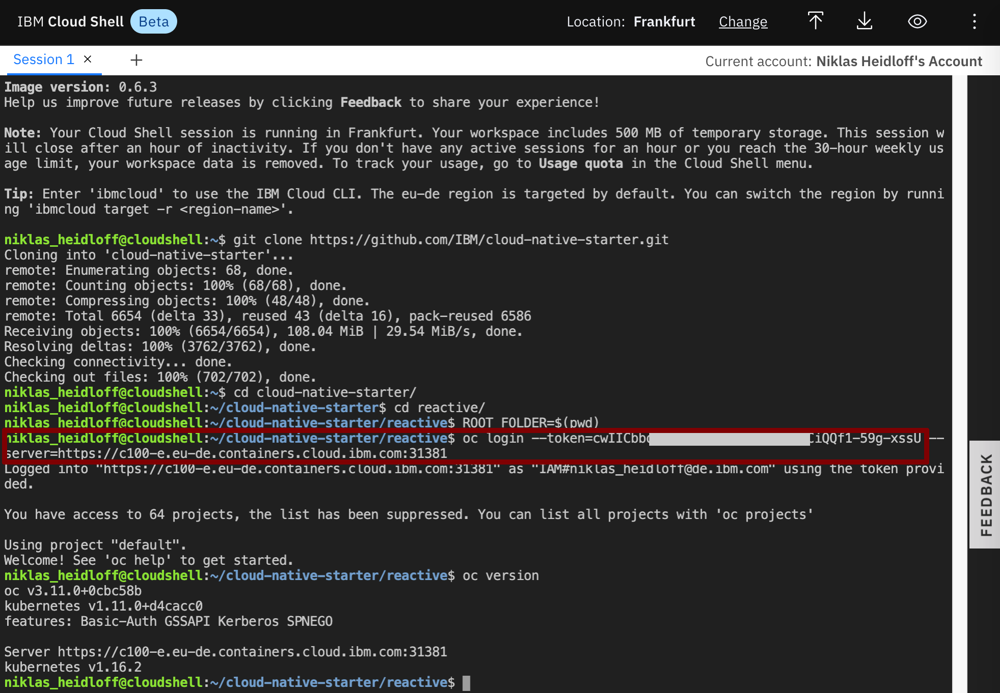

Navigator:
* [Workshop Description](https://nheidloff.github.io/workshop-quarkus-openshift-reactive-messaging/)
* Lab 1: Create your Cloud Environment
* Lab 2: [Deploy Kafka via Script](lab2.md)
* Lab 3: [Deploy Postgres via Operator](lab3.md)
* Lab 4: [Deploy Sample Application](lab4.md)
* Lab 5: [Reactive Messaging with MicroProfile](lab5.md)
* Lab 6: [Server Sent Events](lab6.md)
* Lab 7: [Vert.x Event Bus](lab7.md)

---

# Lab 1: Create your Cloud Environment

An [IBM Cloud account](http://ibm.biz/nheidloff) is needed. It's free, doesn't expire and for the lite account no credit card is required.

We will use preconfigured [OpenShift on IBM Cloud](https://cloud.ibm.com/kubernetes/catalog/openshiftcluster) clusters in this hands-on workshop. You should have received information from your lab instructor to get access to one of these clusters.

Alternatively you can also use [CodeReady Containers](https://github.com/code-ready/crc) to run OpenShift locally.


### Step 1: Set up Work Environment

For this workshop no client side setup is required. Instead we will use the IBM Cloud Shell (Beta):

1. In your browser, login to the [IBM Cloud](https://cloud.ibm.com) Dashboard
2. Make sure you select your own account in the account list, then click on the IBM Cloud Shell Icon

   

Note: Your workspace includes 500 MB of temporary storage. Your session closes after 30 minutes of inactivity. If you’re inactive in Cloud Shell for over an hour, your workspace data is removed. It’s also removed if you reach the 4-hour continuous usage or 30-hour weekly usage limits.

This is what you should see:




### Step 2: Get the Code

In the IBM Cloud Shell execute the following commands:

```
$ git clone https://github.com/IBM/cloud-native-starter.git
$ cd cloud-native-starter
$ cd reactive
$ ROOT_FOLDER=$(pwd)
```



### Step 3. Get Access to OpenShift on the IBM Cloud

### 3.a. Open the OpenShift Console

1. Open the [IBM Cloud Dashboard](https://cloud.ibm.com).

2. Switch from your **own** account to the **IBM account** given to you by the instructor from the pulldown in the uper right corner.

3. Select 'OpenShift' in the burger menu.

    

4. Chose 'OpenShift' and then 'Clusters'.

    

4. Open the OpenShift web console

    

### 3.b. Set up the the 'oc' CLI

1. From the dropdown menu in the upper right of the page, click 'Copy Login Command'. 

    

1. Click on 'Display Token', then copy and paste the command 'Log in with this token' into your terminal in the IBM Cloud Shell.

    

1. Login to OpenShift in IBM Cloud Shell

    ```
    $ oc login https://c1XX-XX-X.containers.cloud.ibm.com:XXXXX --token=xxxxxx'
    ```

    

---

__Continue with [Lab 2: Deploy Kafka via Script](lab2.md)__
