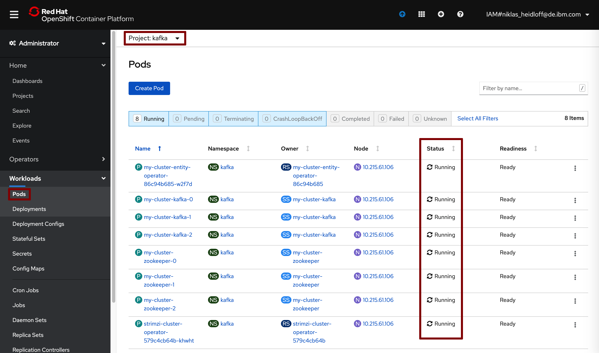

Navigator:
* [Workshop Description](https://nheidloff.github.io/workshop-quarkus-openshift-reactive-endpoints/)
* Lab 1: [Create your Cloud Environment](lab1.md)
* Lab 2: Deploy Kafka via Script
* Lab 3: [Deploy Postgres via Operator](lab3.md)
* Lab 4: [Deploy Sample Application](lab4.md)
* Lab 5: [Develop reactive Endpoints](lab5.md)
* Lab 6: [Invoke Endpoints reactively](lab6.md)
* Lab 7: [Deploy Service to OpenShift](lab7.md)
* Lab 8 (optional): [Use distributed Logging](lab8.md)

---

# Lab 1: Deploy Kafka via Script

In this short lab you'll deploy Kafka via a script.

### Step 1: Deploy Kafka

Invoke the following command:

```
$ ~/cloud-native-starter/reactive/os4-scripts/deploy-kafka-oc-only.sh 
```

As result you will see this:


### Step 2: Verify the Installation 

It takes a couple of minutes until all pods have been started. You can check the status via the OpenShift web console. On the 'Pods' page select the 'kafka' project.



---

__Continue with [Lab 3: Deploy Postgres via Operator](lab3.md)__
