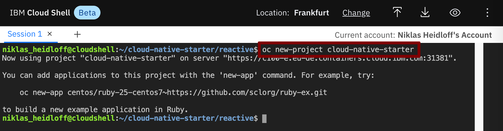
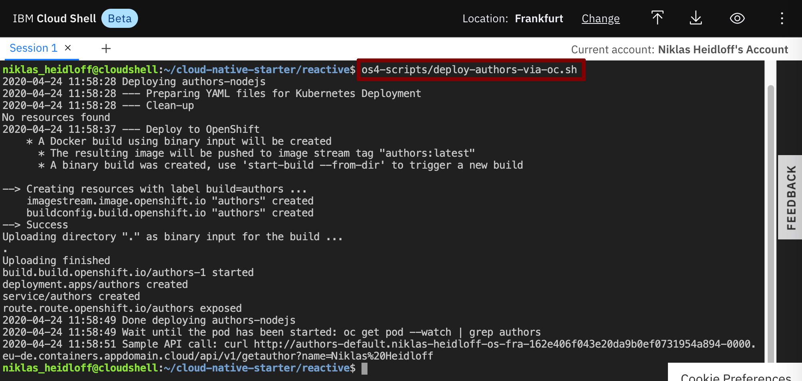
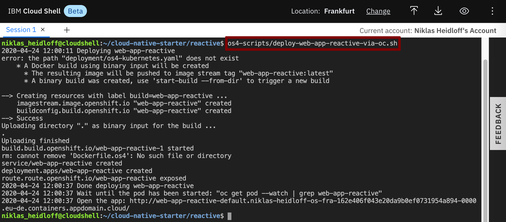
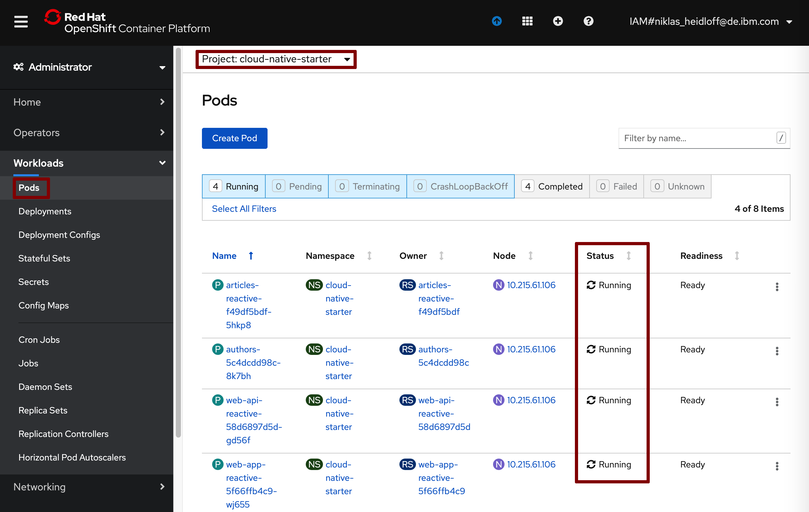
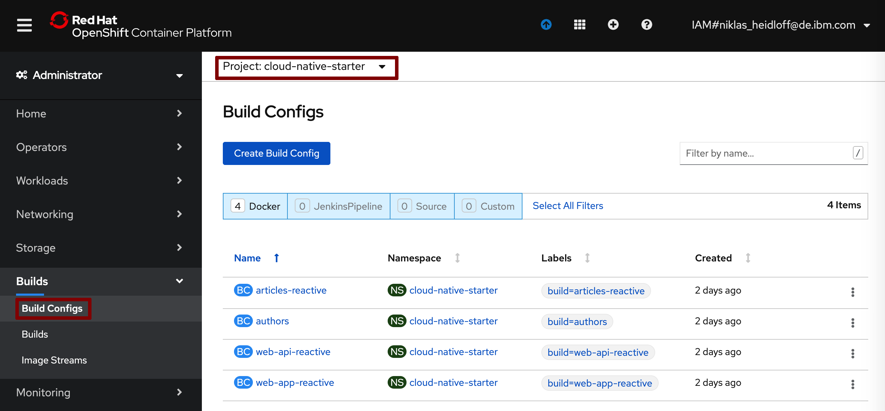
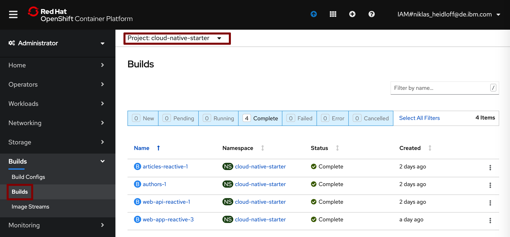
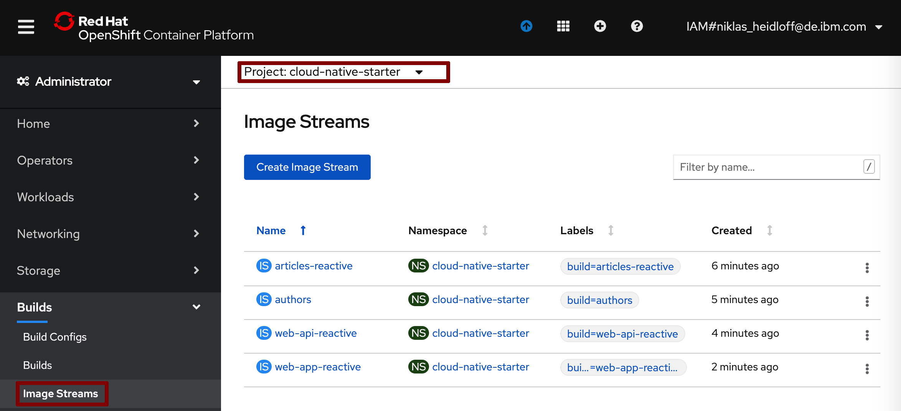
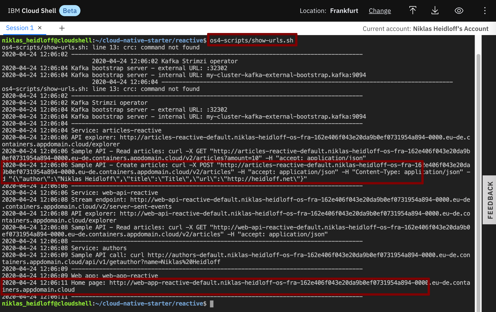

Navigator:
* [Workshop Description](https://nheidloff.github.io/workshop-quarkus-openshift-reactive-endpoints/)
* Lab 1: [Create your Cloud Environment](lab1.md)
* Lab 2: [Deploy Kafka via Script](lab2.md)
* Lab 3: [Deploy Postgres via Operator](lab3.md)
* Lab 4: Deploy Sample Application
* Lab 5: [Develop reactive Endpoints](lab5.md)
* Lab 6: [Invoke Endpoints reactively](lab6.md)
* Lab 7: [Deploy Service to OpenShift](lab7.md)
* Lab 8 (optional): [Use distributed Logging](lab8.md)

---

# Lab 4: Deploy Sample Application

In this lab you'll deploy the sample application which consists of three microservices and a web application.

### Step 1: Create Project

Invoke the following command in the Cloud Shell to create a new project.

```
$ oc new-project cloud-native-starter
```



### Step 2: Deploy Services and Web Application

Invoke the following command in the Cloud Shell to deploy the 'Articles' service.

```
$ ~/cloud-native-starter/reactive/os4-scripts/deploy-articles-reactive-postgres-via-oc.sh
```


Invoke the following command in the Cloud Shell to deploy the 'Authors' service.

```
$ ~/cloud-native-starter/reactive/os4-scripts/deploy-authors-via-oc.sh
```



Invoke the following command in the Cloud Shell to deploy the 'Web-API' service.

```
$ ~/cloud-native-starter/reactive/os4-scripts/deploy-web-api-reactive-via-oc.sh
```


Invoke the following command in the Cloud Shell to deploy the web app.

```
$ ~/cloud-native-starter/reactive/os4-scripts/deploy-web-app-reactive-via-oc.sh
```



### Step 3: Verify the Installation 

Make sure all four pods in the 'cloud-native-starter' project are running. Note that it takes a couple of minutes until this happens.



The previous steps have create build configs, builds and image streams.







To launch the application get the URLs via the following command.

```
$ ~/cloud-native-starter/reactive/os4-scripts/show-urls.sh
```



Open the web application in a browser. Then invoke the curl post command. The web application should show the new entry.


---

__Continue with [Lab 5: Develop reactive Endpoints](lab5.md)__
