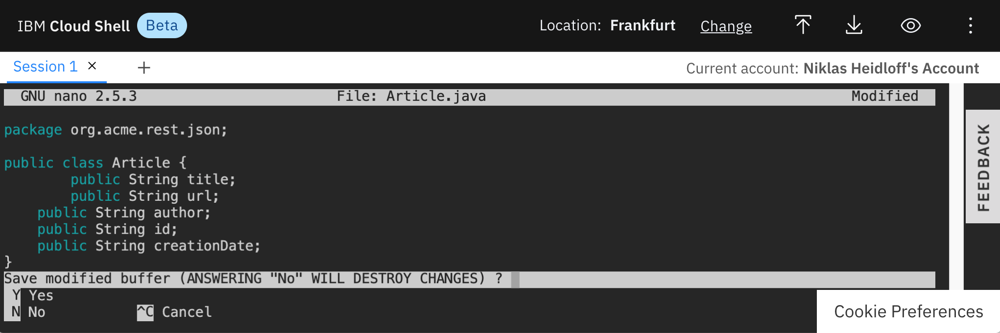
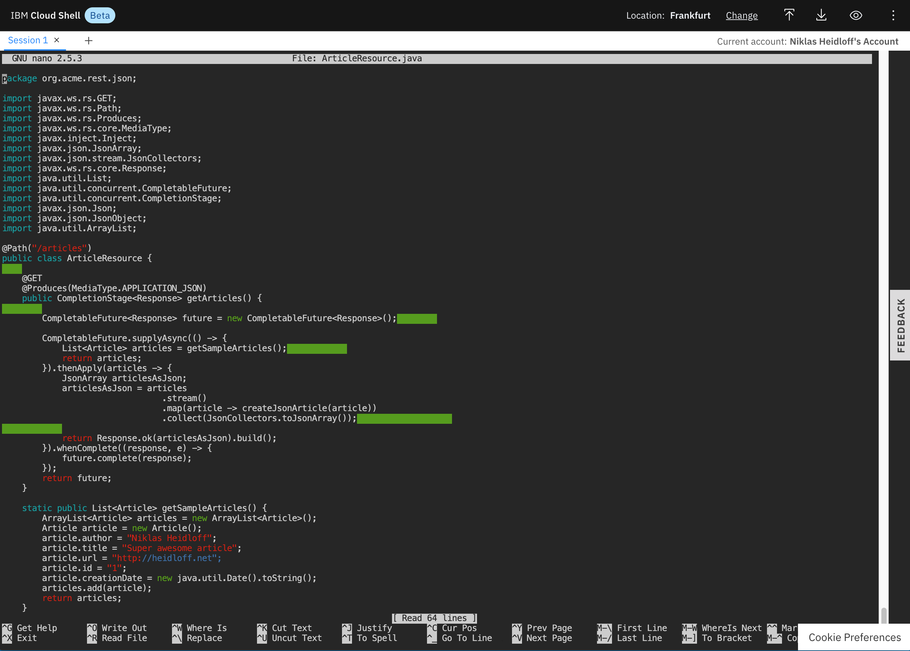

Navigator:
* [Workshop Description](https://nheidloff.github.io/workshop-quarkus-openshift-reactive-endpoints/)
* Lab 1: [Create your Cloud Environment](lab1.md)
* Lab 2: [Deploy Kafka via Script](lab2.md)
* Lab 3: [Deploy Postgres via Operator](lab3.md)
* Lab 4: [Deploy Sample Application](lab4.md)
* Lab 5: Develop reactive Endpoints
* Lab 6: [Invoke Endpoints reactively](lab6.md)
* Lab 7: [Deploy Service to OpenShift](lab7.md)
* Lab 8 (optional): [Use distributed Logging](lab8.md)

---

# Lab 5: Develop reactive Endpoints

In this lab you will learn how to develop reactive endpoints with standard Java functionality via [CompletionStage](https://docs.oracle.com/javase/8/docs/api/java/util/concurrent/CompletionStage.html) and [CompletableFuture](https://docs.oracle.com/javase/8/docs/api/java/util/concurrent/CompletableFuture.html).

### Step 1: Create Quarkus Project

Let's start by creating a new Quarkus project with a synchronous REST endpoint. Invoke the following command the Cloud Shell.

```
$ mvn io.quarkus:quarkus-maven-plugin:1.4.1.Final:create \
    -DprojectGroupId=org.acme \
    -DprojectArtifactId=rest-json-quickstart \
    -DclassName="org.acme.rest.json.FruitResource" \
    -Dpath="/fruits" \
    -Dextensions="resteasy-jsonb"
```

To better understand which files have been created, run the same command locally and explore the generated code via the editor of your choice.

### Step 2: Test the synchronous Endpoint

In order to test the synchronous endpoint which has been created with the command above, run these commands in one terminal in the Cloud Shell.

```
$ cd rest-json-quickstart
$ ./mvnw compile quarkus:dev
```

Open a second terminal in the Cloud Shell and invoke the following command.

```
$ curl http://localhost:8080/fruits
```

You should see the following response.


The implementation of the synchronous endpoint is in the class [FruitResource.java](https://github.com/nheidloff/workshop-quarkus-openshift-reactive-endpoints/blob/master/finish/rest-json-quickstart/src/main/java/org/acme/rest/json/FruitResource.java). The annotations @Path, @Get and @Produces are used to define the endpoint via [JAX-RS](https://en.wikipedia.org/wiki/Java_API_for_RESTful_Web_Services). To learn more about synchronous endpoints, check out the [Quarkus guide](https://quarkus.io/guides/rest-json).

```
$ cd rest-json-quickstart/src/main/java/org/acme/rest/json/
$ cat FruitResource.java 
```


### Step 3: Create Class ArticleResource

Next let's create a reactive endpoint. We need a new class 'ArticleResource.java' and a class 'Article.java'.

```
$ cd ~/rest-json-quickstart/src/main/java/org/acme/rest/json/
$ touch Article.java 
$ touch ArticleResource.java 
$ nano Article.java
```

Add the following code to 'Article.java'.

```
package org.acme.rest.json;

public class Article {
	public String title;
	public String url;
    public String author;
    public String id;
    public String creationDate;
}
```



Exit the Editor via 'Ctrl-X', 'y' and 'Enter'.

Modify the class via nano and add the following skeleton. The complete source is in [GitHub repo](https://github.com/nheidloff/workshop-quarkus-openshift-reactive-endpoints/blob/master/finish/rest-json-quickstart/src/main/java/org/acme/rest/json/ArticleResource.java).

```
$ cd ~/rest-json-quickstart/src/main/java/org/acme/rest/json/
$ nano ArticleResource.java
```

```
package org.acme.rest.json;

import javax.ws.rs.GET;
import javax.ws.rs.Path;
import javax.ws.rs.Produces;
import javax.ws.rs.core.MediaType;
import javax.inject.Inject;
import javax.json.JsonArray;
import javax.json.stream.JsonCollectors;
import javax.ws.rs.core.Response;
import java.util.List;
import java.util.concurrent.CompletableFuture;
import java.util.concurrent.CompletionStage;
import javax.json.Json;
import javax.json.JsonObject;
import java.util.ArrayList;

@Path("/articles")
public class ArticleResource {
    
    @GET
    @Produces(MediaType.APPLICATION_JSON)
    public CompletionStage<Response> getArticles() {
        
        CompletableFuture<Response> future = new CompletableFuture<Response>();        

        CompletableFuture.supplyAsync(() -> {
            List<Article> articles = getSampleArticles();            
            return articles;
        }).thenApply(articles -> {
            JsonArray articlesAsJson;
            articlesAsJson = articles
                                .stream()
                                .map(article -> createJsonArticle(article))
                                .collect(JsonCollectors.toJsonArray());                   
            
            return Response.ok(articlesAsJson).build();
        }).whenComplete((response, e) -> {
            future.complete(response);
        });
        return future;
    }

    static public List<Article> getSampleArticles() {
        ArrayList<Article> articles = new ArrayList<Article>();
        Article article = new Article();
        article.author = "Niklas Heidloff";
        article.title = "Super awesome article";
        article.url = "http://heidloff.net";
        article.id = "1";
        article.creationDate = new java.util.Date().toString();
        articles.add(article);
        return articles;
    }

    static public JsonObject createJsonArticle(Article article) {
        return Json.createObjectBuilder()
                .add("id", article.id)
                .add("title", article.title)
                .add("url", article.url)
                .add("author", article.author)
                .build();
    }
}
```



Exit the Editor via 'Ctrl-X', 'y' and 'Enter'.

### Step 4: Test the reactive Endpoint

In order to test the reactive endpoint, run these commands in one terminal in the Cloud Shell.

```
$ cd ~/rest-json-quickstart
$ ./mvnw compile quarkus:dev
```

Open a second terminal in the Cloud Shell and invoke the following command.

```
$ curl http://localhost:8080/articles
```

You should see the following response.


### Step 5: Understand the Implementation

Now the big question is: How does the reactive endpoint work??? Let's go through the code.

to be done

---

__Continue with [Lab 6: Invoke Endpoints reactively](lab6.md)__
