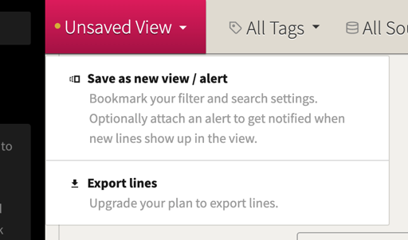
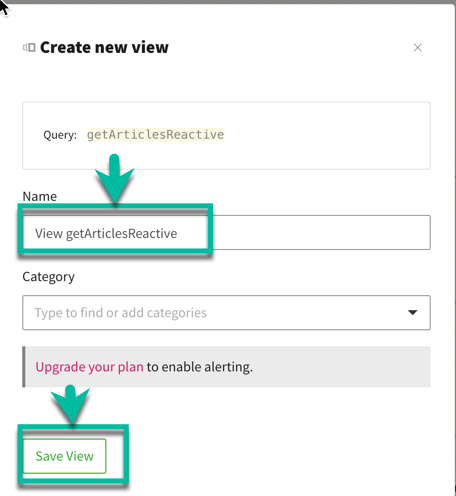

Navigator:
* [Workshop Description](https://nheidloff.github.io/workshop-quarkus-openshift-reactive-endpoints/)
* Lab 1: [Create your Cloud Environment](lab1.md)
* Lab 2: [Deploy Kafka via Script](lab2.md)
* Lab 3: [Deploy Postgres via Operator](lab3.md)
* Lab 4: [Deploy Sample Application](lab4.md)
* Lab 5: [Develop reactive Endpoints](lab5.md)
* Lab 6: [Invoke Endpoints reactively](lab6.md)
* Lab 7: [Deploy Service to OpenShift](lab7.md)
* Lab 8 (optional): Use distributed Logging

---
**** UNDERCONSTRUCTION ****

# Lab 8: Use distributed Logging

to be done

https://github.com/IBM/openshift-on-ibm-cloud-workshops/blob/master/5-logdna-openshift.md

A cloud native application based on microservices contains many parts that create logs. A logging service that is able to collect all distributed logs in one place is a highly recommended tool. There are many logging solutions that you can install directly into your Kubernetes or OpenShift cluster. But then you have an additional application that needs to be maintained and one that needs persistent storage as well to store logs for a period of time. 

IBM Cloud offers "Logging as a Service" in the form of [IBM Log Analysis with LogDNA](https://cloud.ibm.com/docs/services/Log-Analysis-with-LogDNA?topic=LogDNA-getting-started#getting-started). It offers features to filter, search, and tail log data, define alerts, and design custom views to monitor application and system logs. You can test "IBM Log Analysis with LogDNA" for free with somewhat limited capabilities and we will show you in this lab how to connect your OpenShift cluster to an instance of it.

Official documentation for setting up the LogDNA agent for an OpenShift cluster is [here](https://cloud.ibm.com/docs/services/Log-Analysis-with-LogDNA?topic=LogDNA-config_agent_os_cluster).

For the following instructions use the IBM Cloud Shell to enter the commands.

## Step 1 - Create a LogDNA service

1. In your browser log in to the IBM Cloud dashboard

   * Make sure you are using **your own account**.

   * From the "burger menu" select "Observability"

   


1. Create an "IBM Log Analysis with LogDNA" instance

   * Select "Create" tab

   * Leave the pre-selected region

   * Leave the default plan "Lite" with the pricing "Free"

   * Give the service a name "logdna-openshift-reactive"
   
   * Give the tag "reactive"

   * Click "Create"

   

   * Leave the default name or choose your own ("logdna-openshift")

## Step 2 - Configure the LogDNA log sources

1. Select "Edit log sources"

   

  
1. Select the "OpenShift" tab. Copy, paste, and execute the commands into your IBM Cloud Shell:

   


1. Check that the logging agent is running with:

   ```
   $ oc get all -n ibm-observe
   ```
   


   


## Step 2 - Use LogDNA

1. Go back to the IBM Cloud Dashboard
2. From the Burger menu in the upper left corner select "Observability"
3. In the Observability menu select "Logging"
4. Click on "View LogDNA"

   
   (../images/logdna.png)

   This will open the LogDNA dashboard. 

5. In Lab 4 "[Deploying Sample Application](lab4.md)" you have deployed an instance of the articles-reactive. We will check LogDNA for output from this instance. Execute the following commands in the IBM Cloud Shell:

   ```
   $ oc project <your project>
   $ watch curl -X GET "http://$(oc get route articles-reactive -o jsonpath={.spec.host})/v2/articles?amount=10" -H "accept: application/json"  
   ```
   
   The "watch" command will constantly (every 2 seconds) request articles information.

6. Refresh your browser tab with the LogDNA dashboard and insert in the search field "getArticlesReactive"

   

    Note: If you don't see "getArticlesReactive" wait a little longer (with the free/lite version it can take several minutes before data shows up), then refresh the browser tab of the LogDNA dashboard again.

7. Select "Unsaved View->Save as new/alert"

   

8. Give it name "View getArticlesReactive" and press "Save View"
    
   

9. From now the new view is available under "Views"

   [Save view in LogDNA](../images/logdna-view-03.png)

10. Terminate the command from step 5 ("watch curl ...")

---

__Congratulations! You’ve finished the workshop!__
