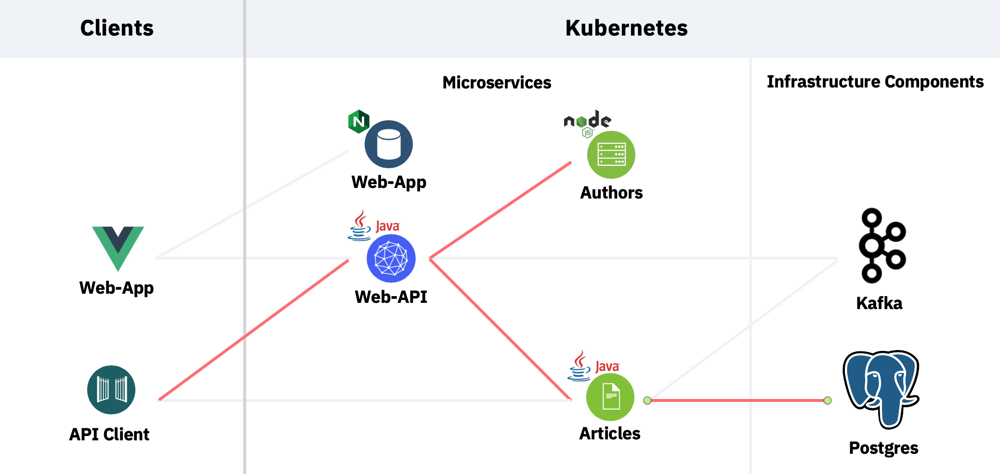
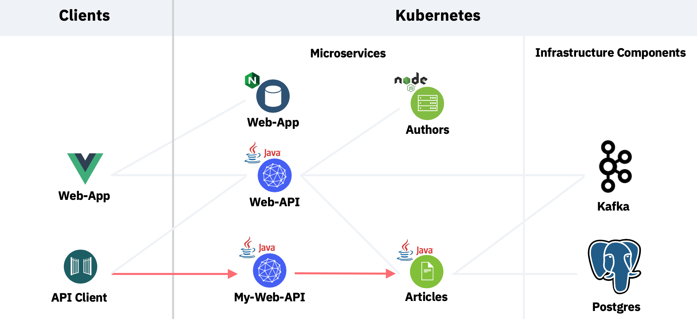

## Workshop: Reactive Endpoints with Quarkus on OpenShift

In this workshop you'll learn how to implement reactive endpoints with Java, [Quarkus](https://quarkus.io/) and [MicroProfile](https://microprofile.io/). An end-to-end sample application will be deployed to [Red Hat OpenShift](https://www.openshift.com/).

The code is available as open source as part of the [Cloud Native Starter](https://github.com/IBM/cloud-native-starter/tree/master/reactive) project. 

One key benefit of reactive systems and reactive REST endpoints is efficiency. This workshop describes how to use reactive systems and reactive programming to achieve faster response times. Especially in public clouds where costs depend on CPU, RAM and compute durations this model saves money.

The workshop uses a sample application to demonstrate reactive functionality. The sample application displays links to articles and author information.

The sample contains a 'Web-API' service with two versions of the endpoint '/articles', one uses imperative code, the other one reactive code. In this workshop you'll re-implement a simplified version of the reactive version yourselves.

The reactive stack of this sample provides response times that take less than half of the time compared to the imperative stack: 

|  Reactive | Imperative  |
| - | - |
| 793 ms | 1956 ms |

If you want to know more details, you can read the [documentation](https://github.com/IBM/cloud-native-starter/blob/master/reactive/documentation/LoadTests.md) of the performance tests.

### Architecture

The following architecture diagrams do explain the complete flow the sample application.

* The 'API Client' invokes the 'Web-API' service which implements a backend-for-frontend pattern. 
* The 'Web-API' service invokes the two microservices 'Authors' and 'Articles'. The 'Articles' service reads data from Postgres.

<kbd></kbd>

Note that in this workshop you will deploy the full application as described in the previous diagram. But to simplify the workshop you'll re-implement a simpler version of the 'Web-API' service which only invokes the 'Articles' service.

<kbd></kbd>

### Estimated time and level

|  Time | Level  |
| - | - |
| one hour | beginners |

### Objectives

After you complete this workshop, you'll understand the following reactive functionality:

* Reactive REST endpoints via CompletionStage
* Exception handling in chained reactive invocations
* Timeouts via CompletableFuture
* Reactive REST invocations via MicroProfile REST Client

*The intention of this workshop is not to explain every aspect of reactive programming, but to explain core reactive principles and to deploy a complete reactive application which you can inspect after the workshop in more detail.*

### About this workshop

The introductory page of the workshop is broken down into the following sections:

* [Agenda](#agenda)
* [Compatibility](#compatibility)
* [Technology Used](#technology-used)
* [Credits](#credits)
* [What`s next?](#whats-next?)

### Agenda

These are the labs of this workshop, go through all of them in sequence, start with lab 1:

|   |   |
| - | - |
| [Lab 1](lab1/README.md) | Create your Cloud Environment |
| [Lab 2](lab2/README.md) | Deploy Kafka via Script |
| [Lab 3](lab3/README.md) | Deploy Postgres via Operator |
| [Lab 4](lab4/README.md) | Deploy Sample Application |
| [Lab 5](lab5/README.md) | Develop reactive Endpoints |
| [Lab 6](lab6/README.md) | Invoke Endpoints reactively |
| [Lab 7](lab7/README.md) | Deploy Service to OpenShift |
| [Lab 8](lab8/README.md) | Use distributed Logging |

### Compatibility

This workshop has been tested on the following platforms:

* **IBM Open Shift**: version 4.3
* **IBM Cloud Shell**: beta

### Technology Used

* [Jakarta EE](https://jakarta.ee/)
* [MicroProfile](https://microprofile.io/)
* [Quarkus](https://quarkus.io/)
* [Apache Kafka](https://kafka.apache.org/)
* [PostgresSQL](https://www.postgresql.org/)
* [RedHat OpenShift](https://www.openshift.com/)
* [Microservices architecture](https://en.wikipedia.org/wiki/Microservices)
* [Vue.js](https://vuejs.org/)

### Credits

* [Niklas Heidloff](https://twitter.com/nheidloff)
* [Harald Uebele](https://twitter.com/Harald_U)
* [Thomas Südbröcker](https://twitter.com/tsuedbroecker)

### What`s next?

The [blogs](https://github.com/IBM/cloud-native-starter/tree/master/reactive#blogs) as well as the [presentation](images/ReactiveMicroservices.pdf) describe the functionality in more detail.

There is a second workshop which uses the same sample application. That workshop is called [Reactive Messaging with Quarkus on OpenShift](https://nheidloff.github.io/workshop-quarkus-openshift-reactive-messaging/) and it focusses on messaging with Kafka.

