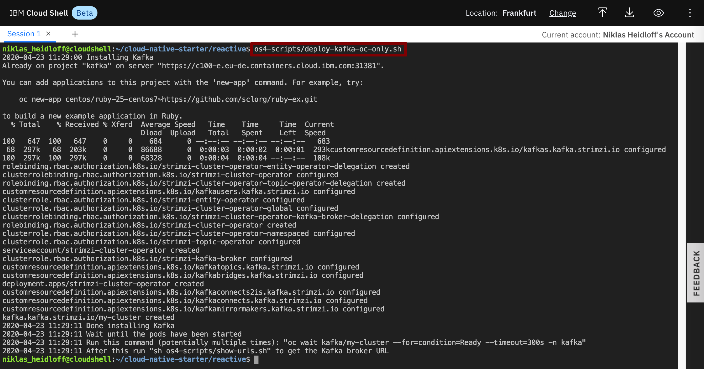

# Exercise 1: Deploy Kafka via Script

In this short lab you'll deploy Kafka via a script.

### Step 1: Deploy Kafka

Invoke the following command:

```
$ ~/cloud-native-starter/reactive/os4-scripts/deploy-kafka-oc-only.sh 
```

As result you will see this:




### Step 2: Verify the Installation 

It takes a couple of minutes until all pods have been started. You can check the status via the OpenShift web console. On the 'Pods' page select the 'kafka' project.


