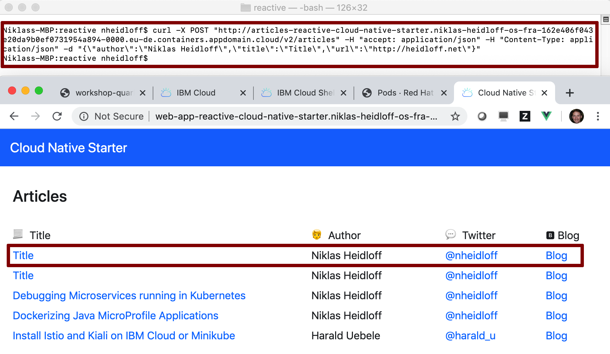

# Exercise 1: Deploy the example application via script

In this short exercise you'll deploy Kafka, PostgreSQL, and the Microservices of the reactive example via a script and test the example application.

### Step 1: Deploy the example application

Invoke the following command:

```
bash ~/cloud-native-starter/reactive/os4-scripts/deploy-example.sh 
```

> The deployment takes approximately `10 minutes`.

The script console output shows links to the Microservices and the Web-App at the end of the execution.

The following `35 sec` YouTube video shows a example execution of the script and the test of the application.

[](https://www.youtube.com/watch?v=RYGCrsR37Go "Click play on youtube")


### Step 2: Launch the web application

To launch the web application get the URL from the last output and open the application in a browser.


### Step 3: Copy the curl command

Copy the curl command to create a new article and insert it into your current terminal session.


### Step 4: Test the example application

Open the web application in a browser. Then invoke the curl post command. The web application should show the new entry.



### Step 5 (optional): Verify the deployed PostgreSQL

You can check the status via the OpenShift web console. On the 'Pods' page select the 'postgres' project.


### Step 6 (optional): Verify the deployed Kafka

You can check the status via the OpenShift web console. On the 'Pods' page select the 'kafka' project.


### Step 7 (optional): Verify the deployed Services and Web Application

Make sure all four pods in the 'cloud-native-starter' project are running.


The previous steps have create build configs, builds and image streams.


