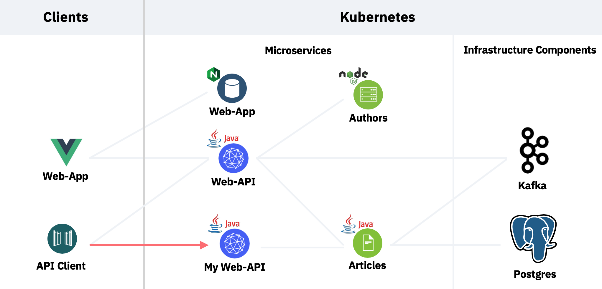
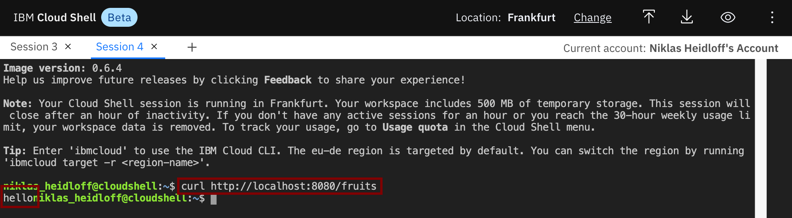
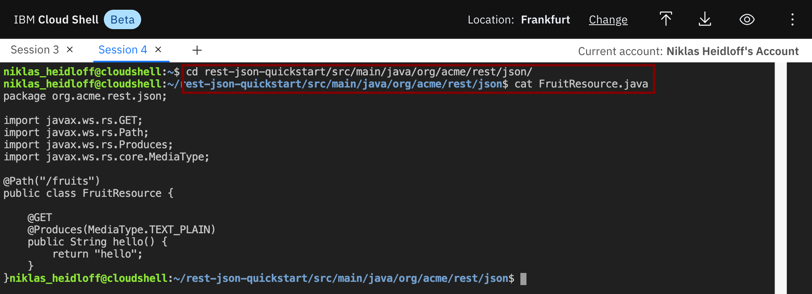
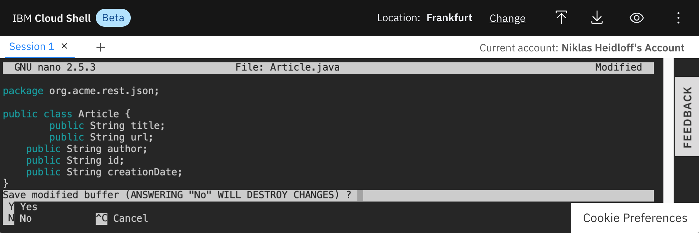
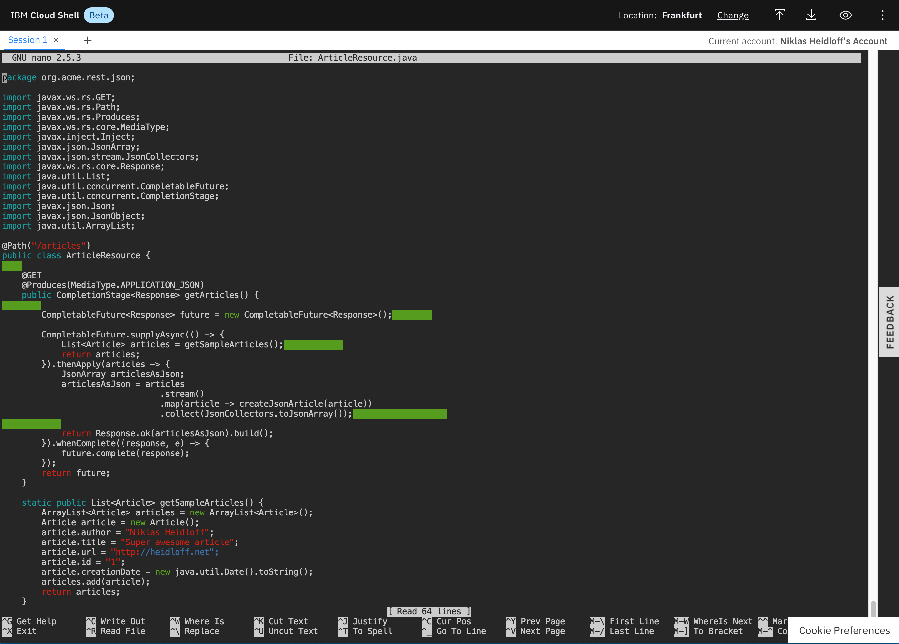
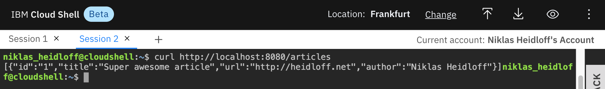

# Exercise 1: Develop reactive Endpoints

In this exercise you will learn how to develop reactive endpoints with standard Java functionality via [CompletionStage](https://docs.oracle.com/javase/8/docs/api/java/util/concurrent/CompletionStage.html) and [CompletableFuture](https://docs.oracle.com/javase/8/docs/api/java/util/concurrent/CompletableFuture.html). 

The service that will be created is an easier implementation of the 'Web-API' service as described earlier. In this exercise the service only returns some dummy data and doesn't invoke other services.



### Step 1: Create Quarkus Project

Let's start by creating a new Quarkus project with a synchronous REST endpoint. Invoke the following command the Cloud Shell.

```sh
cd ~/cloud-native-starter/reactive
mvn io.quarkus:quarkus-maven-plugin:1.7.0.Final:create \
    -DprojectGroupId=org.acme \
    -DprojectArtifactId=rest-json-quickstart \
    -DclassName="org.acme.rest.json.FruitResource" \
    -Dpath="/fruits" \
    -Dextensions="resteasy-jsonb"
```

To better understand which files have been created, run the same command locally and explore the generated code via the editor of your choice.

### Step 2: Test the synchronous Endpoint

In order to test the synchronous endpoint which has been created with the command above, run these commands in one terminal in the Cloud Shell.

```sh
cd ~/cloud-native-starter/reactive/rest-json-quickstart
./mvnw compile quarkus:dev
```

Open a second terminal in the Cloud Shell and invoke the following command.

```sh
curl http://localhost:8080/fruits
```

You should see the following response.



The implementation of the synchronous endpoint is in the class [FruitResource.java](https://github.com/nheidloff/workshop-quarkus-openshift-reactive-endpoints/blob/master/finish/rest-json-quickstart/src/main/java/org/acme/rest/json/FruitResource.java). The annotations @Path, @Get and @Produces are used to define the endpoint via [JAX-RS](https://en.wikipedia.org/wiki/Java_API_for_RESTful_Web_Services). To learn more about synchronous endpoints, check out the [Quarkus guide](https://quarkus.io/guides/rest-json).

```sh
cd ~/cloud-native-starter/reactive/rest-json-quickstart/src/main/java/org/acme/rest/json/
cat FruitResource.java 
```



### Step 3: Create Classes Article and ArticleResource

Next let's create a reactive endpoint. We need a new class `'ArticleResource.java'` and a class `'Article.java'`.

```sh
cd ~/cloud-native-starter/reactive/rest-json-quickstart/src/main/java/org/acme/rest/json/
touch Article.java 
touch ArticleResource.java 
nano Article.java
```

Add the following code to `'Article.java'`.

```java
package org.acme.rest.json;

public class Article {
  public String title;
  public String url;
  public String author;
  public String id;
  public String creationDate;
}
```



Exit the Editor via 'Ctrl-X', 'y' and 'Enter'.

Modify the ArticleResource class via nano and add the following skeleton. The complete source is in the [GitHub repo](https://github.com/nheidloff/workshop-quarkus-openshift-reactive-endpoints/blob/master/finish/rest-json-quickstart/src/main/java/org/acme/rest/json/ArticleResource.java).

```sh
cd ~/cloud-native-starter/reactive/rest-json-quickstart/src/main/java/org/acme/rest/json/
nano ArticleResource.java
```

```java
package org.acme.rest.json;

import javax.ws.rs.GET;
import javax.ws.rs.Path;
import javax.ws.rs.Produces;
import javax.ws.rs.core.MediaType;
import javax.inject.Inject;
import javax.json.JsonArray;
import javax.json.stream.JsonCollectors;
import javax.ws.rs.core.Response;
import java.util.List;
import java.util.concurrent.CompletableFuture;
import java.util.concurrent.CompletionStage;
import javax.json.Json;
import javax.json.JsonObject;
import java.util.ArrayList;

@Path("/articles")
public class ArticleResource {
    
    @GET
    @Produces(MediaType.APPLICATION_JSON)
    public CompletionStage<Response> getArticles() {
        
        CompletableFuture<Response> future = new CompletableFuture<Response>();        

        CompletableFuture.supplyAsync(() -> {
            List<Article> articles = getSampleArticles();            
            return articles;
        }).thenApply(articles -> {
            JsonArray articlesAsJson;
            articlesAsJson = articles
                                .stream()
                                .map(article -> createJsonArticle(article))
                                .collect(JsonCollectors.toJsonArray());                   
            
            return Response.ok(articlesAsJson).build();
        }).whenComplete((response, e) -> {
            future.complete(response);
        });
        return future;
    }

    static public List<Article> getSampleArticles() {
        ArrayList<Article> articles = new ArrayList<Article>();
        Article article = new Article();
        article.author = "Niklas Heidloff";
        article.title = "Super awesome article";
        article.url = "http://heidloff.net";
        article.id = "1";
        article.creationDate = new java.util.Date().toString();
        articles.add(article);
        return articles;
    }

    static public JsonObject createJsonArticle(Article article) {
        return Json.createObjectBuilder()
                .add("id", article.id)
                .add("title", article.title)
                .add("url", article.url)
                .add("author", article.author)
                .build();
    }
}
```



Exit the Editor via 'Ctrl-X', 'y' and 'Enter'.

### Step 4: Test the reactive Endpoint

In order to test the reactive endpoint, run these commands in one terminal in the Cloud Shell.

```
cd ~/cloud-native-starter/reactive/rest-json-quickstart/
./mvnw compile quarkus:dev
```

Open a second terminal in the Cloud Shell and invoke the following command.

```
curl http://localhost:8080/articles
```

You should see the following response.



### Step 5: Understand the basic Implementation

Now the big question is: How does the reactive endpoint work??? Let's go through the code line by line.

Reactive endpoints use the same JAX-RS annotations `'@Path'`, `'@Get'` and `'@Produces'` as synchronous endpoints.

```java
@Path("/articles")
public class ArticleResource {
    
    @GET
    @Produces(MediaType.APPLICATION_JSON)
    public CompletionStage<Response> getArticles() {
```

The key difference is the return type. Rather than returning a [Response](https://docs.oracle.com/javaee/7/api/javax/ws/rs/core/Response.html) object, a [CompletionStage](https://docs.oracle.com/javase/8/docs/api/java/util/concurrent/CompletionStage.html) with a Response object is returned.

The `CompletionStage` is returned immediately, so that the thread is not blocked. Only when it's completed, a `callback` is invoked which contains the actual response.

To demonstrate this behavior better, a `[CompletableFuture](https://docs.oracle.com/javase/8/docs/api/java/util/concurrent/CompletableFuture.html)` instance is created and returned. `CompletableFuture` is an implementation of the `CompletionStage` instance. Once the asynchronous code has been completed, a method `'complete'` is invoked on the `CompletableFuture` object.

The static method 'CompletableFuture.supplyAsync()'` returns a list of sample articles asynchronously for demo purposes. In this case only one sample article is returned.

```java
public CompletionStage<Response> getArticles() {
        
        CompletableFuture<Response> future = new CompletableFuture<Response>();        

        CompletableFuture.supplyAsync(() -> {
            List<Article> articles = getSampleArticles();            
            return articles;
        }).thenApply(articles -> {
           ...
        }).whenComplete((response, e) -> {
            future.complete(response);
        });
        return future;
    }
```

The `CompletionStage` interface has several methods. Most of them return CompletionStages again. This allows chaining method invocations as done in the sample code. As input parameters functions are passed in via `[Java Lambda](https://www.oracle.com/webfolder/technetwork/tutorials/obe/java/Lambda-QuickStart/index.html)`.

The method `'whenComplete'` is triggered after the asynchronous methods have been completed. 

Another method of CompletionStage is `'thenApply'`. This method is invoked after the previous asynchronous methods have been completed. The method can be used, for example, to convert data. In the sample code the list of articles is converted in two steps. First the list of article is converted into a JSON array and then the array is converted into a Response object.

The methods `'stream'` and `'map'` are only used for the conversion and not related to reactive programming.

```java
public CompletionStage<Response> getArticles() {
        
        CompletableFuture<Response> future = new CompletableFuture<Response>();        

        CompletableFuture.supplyAsync(() -> {
            List<Article> articles = getSampleArticles();            
            return articles;
        }).thenApply(articles -> {
            JsonArray articlesAsJson;
            articlesAsJson = articles
                                .stream()
                                .map(article -> createJsonArticle(article))
                                .collect(JsonCollectors.toJsonArray());                   
            
            return Response.ok(articlesAsJson).build();
        }).whenComplete((response, e) -> {
            future.complete(response);
        });
        return future;
    }
```

### Step 6: Understand Exception Handling

In the same way exceptions and errors can occur for synchronous code, they can happen for asychronous code as well.

However the way to handle them is quite different. When invoking asynchronous methods exceptions cannot be handled via `'catch'` as usual. Instead the method `'exceptionally'` of the interface `CompletionStage` is used.

The code below should give you an idea how to handle exceptions. To find out more, read the blog [Chained asynchronous Invocations and Error Handling](http://heidloff.net/article/developing-reactive-rest-apis-with-quarkus/).

If you want to try out `'exceptionally'` uncomment the line where the InvalidInputParameter exception is thrown.

```
    @GET
    @Produces(MediaType.APPLICATION_JSON)
    public CompletionStage<Response> getArticles() {
        
        CompletableFuture<Response> future = new CompletableFuture<Response>();        
        CompletableFuture.supplyAsync(() -> {
            List<Article> articles = getSampleArticles();            
            return articles;
        }).thenApply(articles -> {
            JsonArray articlesAsJson;
            articlesAsJson = articles
                                .stream()
                                .map(article -> createJsonArticle(article))
                                .collect(JsonCollectors.toJsonArray());
            
            //if (true) throw new InvalidInputParameter();
            
            return Response.ok(articlesAsJson).build();
        }).exceptionally(throwable -> {
            if (throwable.getCause().toString().equals(InvalidInputParameter.class.getName()))
                return Response.status(Response.Status.BAD_REQUEST).build();
            return Response.status(Response.Status.INTERNAL_SERVER_ERROR).build();
        }).whenComplete((response, e) -> {
            future.complete(response);
        });
        return future;
    }
```

