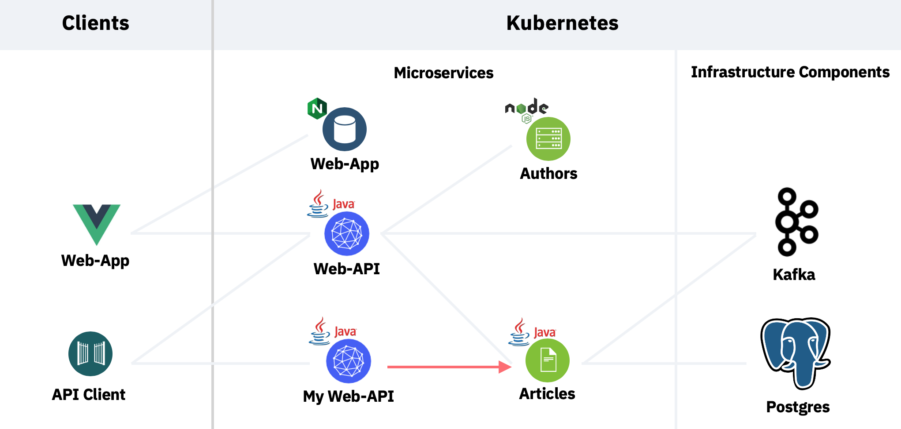
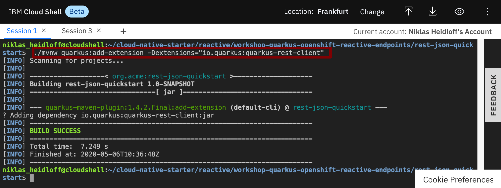
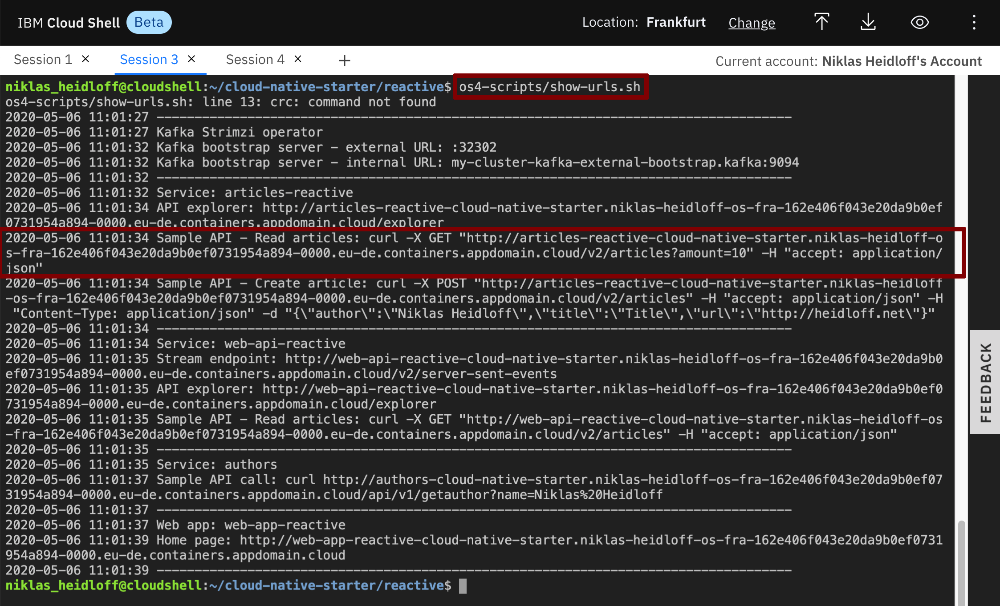
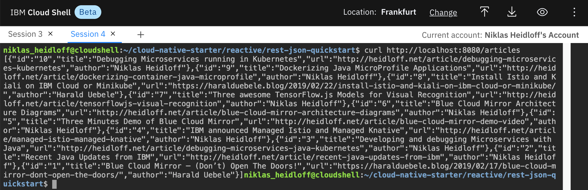

# Exercise 2: Invoke Endpoints reactively

In this exercise you will learn how to invoke REST APIs reactively with [MicroProfile Rest Client](https://github.com/eclipse/microprofile-rest-client).

You will extend the service from the previous exercise to invoke the 'Articles' service which runs on OpenShift.



### Step 1: Add the MicroProfile Extension

First the MicroProfile library needs to be added to the project.

```
cd ~/cloud-native-starter/reactive/rest-json-quickstart
./mvnw quarkus:add-extension -Dextensions="io.quarkus:quarkus-rest-client"
```



### Step 2: Create Exception Handling Classes

The great thing about the MicroProfile REST Client is that it makes it really easy to invoke remote APIs of other services. As developer you don't have to worry about serialization/deserialization/etc. All you need to do is to define interfaces and some configuration.

In order to map HTTP response codes to Java exceptions, a ResponseExceptionMapper is used. Let's take a look.

* Create the class [InvalidInputParameter.java](https://github.com/nheidloff/workshop-quarkus-openshift-reactive-endpoints/blob/master/finish/rest-json-quickstart/src/main/java/org/acme/rest/json/InvalidInputParameter.java). 

This exception is thrown by the 'Articles' service when the amount parameter is not correct, for example if the value is negative.

```
cd ~/cloud-native-starter/reactive/rest-json-quickstart/src/main/java/org/acme/rest/json/
touch InvalidInputParameter.java
nano InvalidInputParameter.java
```

```
package org.acme.rest.json;

public class InvalidInputParameter extends RuntimeException {

	private static final long serialVersionUID = 2L;

	public InvalidInputParameter() {
	}

	public InvalidInputParameter(String message) {
		super(message);
	}
}
```

* Exit the Editor via 'Ctrl-X', 'y' and 'Enter'.

Create the class [ExceptionMapperArticles.java](https://github.com/nheidloff/workshop-quarkus-openshift-reactive-endpoints/blob/master/finish/rest-json-quickstart/src/main/java/org/acme/rest/json/ExceptionMapperArticles.java). In this class the HTTP response code '204' is mapped to the InvalidInputParameter exception.


```
cd ~/cloud-native-starter/reactive/rest-json-quickstart/src/main/java/org/acme/rest/json/
touch ExceptionMapperArticles.java
nano ExceptionMapperArticles.java
```

```
package org.acme.rest.json;

import org.eclipse.microprofile.rest.client.ext.ResponseExceptionMapper;
import javax.ws.rs.core.MultivaluedMap;
import javax.ws.rs.core.Response;
import javax.ws.rs.ext.Provider;

@Provider
public class ExceptionMapperArticles implements ResponseExceptionMapper<InvalidInputParameter> {

    @Override
    public boolean handles(int status, MultivaluedMap<String, Object> headers) {
        return status == 204;
    }

    @Override
    public InvalidInputParameter toThrowable(Response response) {
        if (response.getStatus() == 204)
            return new InvalidInputParameter();
        return null;
    }
}
```

Exit the Editor via 'Ctrl-X', 'y' and 'Enter'.

### Step 3: Create the ArticlesService Interface

Next an interface of the service that is supposed to be invoked is defined. The implementation of this interface is provided magically by MicroProfile.

* Create the class [ArticlesService.java](https://github.com/nheidloff/workshop-quarkus-openshift-reactive-endpoints/blob/master/finish/rest-json-quickstart/src/main/java/org/acme/rest/json/ArticlesService.java). To keep this as simple as possible, there is only one method to read a list of articles.

Note that the annotations `@Get` and `@Produces` can be confusing. These are the JAX-RS annotations you used in the previous exercise. This time however they are not used to expose REST APIs, but to define how to invoke remote APIs.

Also note that the service does not return a Response object directly. Instead it returns a CompletionStage object with a Response object as described earlier. With the MicroProfile Rest Client you can invoke services both synchronously as well as asynchronously.

```
cd ~/cloud-native-starter/reactive/rest-json-quickstart/src/main/java/org/acme/rest/json/
touch ArticlesService.java
nano ArticlesService.java
```

```
package org.acme.rest.json;

import org.eclipse.microprofile.rest.client.annotation.RegisterProvider;
import javax.ws.rs.*;
import javax.ws.rs.core.MediaType;
import java.util.List;
import java.util.concurrent.CompletionStage;

@RegisterProvider(ExceptionMapperArticles.class)
public interface ArticlesService {

    @GET
    @Produces(MediaType.APPLICATION_JSON)
    CompletionStage<List<Article>> getArticlesFromService(@QueryParam("amount") int amount);
}
```

Exit the Editor via 'Ctrl-X', 'y' and 'Enter'.

### Step 4: Create the Code to invoke Services 

Now let's write the code to invoke the 'Articles' service. Basically all you need to do is to define the URL of the endpoint and invoke a Java method. Check out the code below, especially the invocation of the service via 'articlesService.getArticlesFromService(amount)'.

Create the class [ArticlesDataAccess.java](https://github.com/nheidloff/workshop-quarkus-openshift-reactive-endpoints/blob/master/finish/rest-json-quickstart/src/main/java/org/acme/rest/json/ArticlesDataAccess.java).


```
cd ~/cloud-native-starter/reactive/rest-json-quickstart/src/main/java/org/acme/rest/json/
touch ArticlesDataAccess.java
nano ArticlesDataAccess.java
```

```
package org.acme.rest.json;

import org.eclipse.microprofile.config.inject.ConfigProperty;
import org.eclipse.microprofile.rest.client.RestClientBuilder;
import javax.annotation.PostConstruct;
import javax.enterprise.context.ApplicationScoped;
import javax.ws.rs.core.UriBuilder;
import java.net.URI;
import java.util.List;
import java.util.concurrent.CompletionStage;
import java.util.concurrent.TimeUnit;

@ApplicationScoped
public class ArticlesDataAccess {

    private static final int MAXIMAL_DURATION = 5000;

    // this configuration needs to be used when running this web-api service locally
    // run the following command to get this URL: os4scripts/show-urls.sh
    private static String urlArticlesServiceOpenShift = "http://articles-reactive-cloud-native-starter.niklas-heidloff-os-fra-162e406f043e20da9b0ef0731954a894-0000.eu-de.containers.appdomain.cloud/v2/articles?amount=10";

    private ArticlesService articlesService;

    @PostConstruct
    void initialize() {
        URI apiUrl = UriBuilder.fromUri(urlArticlesServiceOpenShift).build();
        articlesService = RestClientBuilder.newBuilder()
                .baseUri(apiUrl)
                .register(ExceptionMapperArticles.class)
                .build(ArticlesService.class);
    }

    public CompletionStage<List<Article>> getArticlesReactive(int amount) {
        return articlesService.getArticlesFromService(amount);
    }
}
```

Open a `second terminal session` and run the following command to get the URL of your `'Articles'` service.

```
cd ~/cloud-native-starter/reactive
os4-scripts/show-urls.sh
```



Copy and paste the `URL` in the class  `ArticlesDataAccess` you have open in your editor.
Replace the value for the variable `'urlArticlesServiceOpenShift'` with your copied value.

```java
   ...
   private static String urlArticlesServiceOpenShift = "YOUR-URL-VALUE";
   ...
```

Exit the Editor via 'Ctrl-X', 'y' and 'Enter'.

### Step 5: Modify the `ArticleResource` class

In the last step you need to modify [ArticleResource.java](https://github.com/nheidloff/workshop-quarkus-openshift-reactive-endpoints/blob/master/finish/rest-json-quickstart/src/main/java/org/acme/rest/json/ArticleResource.java) from the previous exercise to invoke the actual service rather than returning a sample article.

```
cd ~/cloud-native-starter/reactive/rest-json-quickstart/src/main/java/org/acme/rest/json/
rm ArticleResource.java
touch ArticleResource.java
nano ArticleResource.java
```

```
package org.acme.rest.json;

import javax.ws.rs.GET;
import javax.ws.rs.Path;
import javax.ws.rs.Produces;
import javax.ws.rs.core.MediaType;
import javax.inject.Inject;
import javax.json.JsonArray;
import javax.json.stream.JsonCollectors;
import javax.ws.rs.core.Response;
import java.util.List;
import java.util.concurrent.CompletableFuture;
import java.util.concurrent.CompletionStage;
import javax.json.Json;
import javax.json.JsonObject;
import java.util.ArrayList;

@Path("/articles")
public class ArticleResource {

    @Inject
    ArticlesDataAccess articlesDataAccess;

    @GET
    @Produces(MediaType.APPLICATION_JSON)
    public CompletionStage<Response> getArticles() {
        
        CompletableFuture<Response> future = new CompletableFuture<Response>();        

        articlesDataAccess.getArticlesReactive(10).thenApply(articles -> {
            JsonArray articlesAsJson;
            articlesAsJson = articles
                                .stream()
                                .map(article -> createJsonArticle(article))
                                .collect(JsonCollectors.toJsonArray());            
            
            return Response.ok(articlesAsJson).build();
        }).exceptionally(throwable -> {
            if (throwable.getCause().toString().equals(InvalidInputParameter.class.getName()))
                return Response.status(Response.Status.BAD_REQUEST).build();
            return Response.status(Response.Status.INTERNAL_SERVER_ERROR).build();
        }).whenComplete((response, e) -> {
            future.complete(response);
        });
        return future;
    }

    static public List<Article> getSampleArticles() {
        ArrayList<Article> articles = new ArrayList<Article>();
        Article article = new Article();
        article.author = "Niklas Heidloff";
        article.title = "Super awesome article";
        article.url = "http://heidloff.net";
        article.id = "1";
        article.creationDate = new java.util.Date().toString();
        articles.add(article);
        return articles;
    }

    static public JsonObject createJsonArticle(Article article) {
        return Json.createObjectBuilder()
                .add("id", article.id)
                .add("title", article.title)
                .add("url", article.url)
                .add("author", article.author)
                .build();
    }
}
```

### Step 6: Test the Code

In order to test the reactive endpoint, run these commands in one terminal in the Cloud Shell.

```
cd ~/cloud-native-starter/reactive/rest-json-quickstart
./mvnw compile quarkus:dev
```

Open a second terminal in the Cloud Shell and invoke the following command.

```
curl http://localhost:8080/articles
```

You should see the following response.



### Step 7: Understand Timeouts

When writing asynchronous code it's important to consider timeouts, especially when you invoke third party services like databases or other microservices.

Fortunately starting with Java 9 this is easy to handle. When invoking the `'Articles'` service via MicroProfile, you can use the method `'orTimeout'`. If it comes to a timeout, an exception is thrown which you can handled via `'exceptionally'` as explained in the last exercise.

```java
public CompletionStage<List<Article>> getArticlesReactive(int amount) {
  return articlesService.getArticlesFromService(amount)
    .toCompletableFuture()
    .orTimeout(MAXIMAL_DURATION, TimeUnit.MILLISECONDS);
}
```

The method `'orTimeout'` doesn't exist in the CompletionStage interface. You need to run `'toCompletableFuture'` first to get an instance of CompletableFuture.

Unfortunately this capability is only available in Java 9+. Since the current version of the Cloud Shell supports only Java 8, we cannot run it here. But you can obviously run it locally or in a container on OpenShift.

