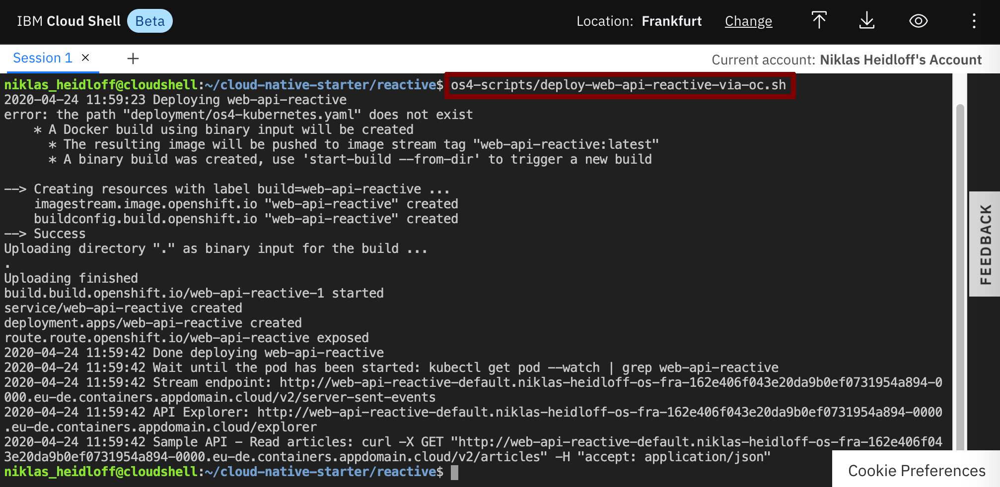

# Exercise 3: Deploy Sample Application

In this lab you'll deploy the sample application which consists of three microservices and a web application.

### Step 1: Create Project

Invoke the following command in the Cloud Shell to create a new project.

```
$ oc new-project cloud-native-starter
```


### Step 2: Deploy Services and Web Application

Invoke the following command in the Cloud Shell to deploy the 'Articles' service.

```
$ ~/cloud-native-starter/reactive/os4-scripts/deploy-articles-reactive-postgres-via-oc.sh
```


Invoke the following command in the Cloud Shell to deploy the 'Authors' service.

```
$ ~/cloud-native-starter/reactive/os4-scripts/deploy-authors-via-oc.sh
```


Invoke the following command in the Cloud Shell to deploy the 'Web-API' service.

```
$ ~/cloud-native-starter/reactive/os4-scripts/deploy-web-api-reactive-via-oc.sh
```



Invoke the following command in the Cloud Shell to deploy the web app.

```
$ ~/cloud-native-starter/reactive/os4-scripts/deploy-web-app-reactive-via-oc.sh
```


### Step 3: Verify the Installation 

Make sure all four pods in the 'cloud-native-starter' project are running. Note that it takes a couple of minutes until this happens.


The previous steps have create build configs, builds and image streams.


To launch the application get the URLs via the following command.

```
$ ~/cloud-native-starter/reactive/os4-scripts/show-urls.sh
```


Open the web application in a browser. Then invoke the curl post command. The web application should show the new entry.


