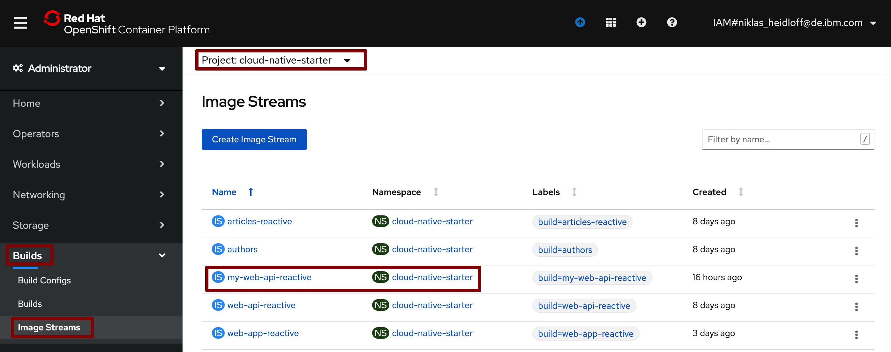

# Exercise 3: Deploy Service to OpenShift

In this exercise you will deploy your 'My-Web-API' service to OpenShift.

### Step 1: Change the Endpoint URL

Once the service is running on Kubernetes or OpenShift, it can access other services easily via DNS, for example in our case via "http://articles-reactive:8080/". In that case the traffic only occurs

Re-create the class [ArticlesDataAccess.java](https://github.com/nheidloff/workshop-quarkus-openshift-reactive-endpoints/blob/master/finish/rest-json-quickstart/src/main/java/org/acme/rest/json/ArticlesDataAccess.java).

```
cd ~/cloud-native-starter/reactive/rest-json-quickstart/src/main/java/org/acme/rest/json/
rm ArticlesDataAccess.java
touch ArticlesDataAccess.java
nano ArticlesDataAccess.java
```

```
package org.acme.rest.json;

import org.eclipse.microprofile.config.inject.ConfigProperty;
import org.eclipse.microprofile.rest.client.RestClientBuilder;
import javax.annotation.PostConstruct;
import javax.enterprise.context.ApplicationScoped;
import javax.ws.rs.core.UriBuilder;
import java.net.URI;
import java.util.List;
import java.util.concurrent.CompletionStage;
import java.util.concurrent.TimeUnit;

@ApplicationScoped
public class ArticlesDataAccess {

    private static final int MAXIMAL_DURATION = 5000;

    // this configuration needs to be used when running the code in OpenShift
    private static String urlArticlesServiceLocal = "http://articles-reactive:8080/v2/articles?amount=10";       

    private ArticlesService articlesService;

    @PostConstruct
    void initialize() {
        URI apiUrl = UriBuilder.fromUri(urlArticlesServiceLocal).build();
        articlesService = RestClientBuilder.newBuilder()
                .baseUri(apiUrl)
                .register(ExceptionMapperArticles.class)
                .build(ArticlesService.class);
    }

    public CompletionStage<List<Article>> getArticlesReactive(int amount) {
        return articlesService.getArticlesFromService(amount);
    }
}
```

Exit the Editor via 'Ctrl-X', 'y' and 'Enter'.

### Step 2: Build the Image

Invoke the following commands to build the image.

```
cd ~/cloud-native-starter/reactive/rest-json-quickstart/
oc project cloud-native-starter
mvn package
mv src/main/docker/Dockerfile.jvm ./Dockerfile
oc new-build --name my-web-api-reactive --binary --strategy docker 
oc start-build my-web-api-reactive --from-dir=.
```


The build will take some time. In the meantime you can check out the Dockerfile, for example to see how the ubi-minimal image is used.

```
cd ~/cloud-native-starter/reactive/rest-json-quickstart/
cat Dockerfile
```

Open the OpenShift Web Console and wait for the build to be completed.


The output of the build will be a new image stream.



### Step 3: Deploy and test the Image

In the 'Developer' view, click on 'Add' and then 'Container Image'.


On the next page choose 'Image from internal registry' and define the project, stream name and tag.


Leave all other defaults including 'Create a route' and click 'Create'.


On the next page click on 'my-web-api-reactive'.


Wait until the pod is running. After this click on the route at the bottom.


This will display the home page of the generated service. To invoke your endpoint append 'articles' to the URL.


