# Exercise 4 (optional): Use distributed Logging

Cloud native applications based on microservices contain many parts that create logs. A logging service that is able to collect all distributed logs in one place is a highly recommended tool. There are many logging solutions that you can install directly into your Kubernetes or OpenShift cluster. But then you have an additional application that needs to be maintained and one that needs persistent storage as well to store logs for a period of time. 

IBM Cloud offers "Logging as a Service" in the form of [IBM Log Analysis with LogDNA](https://cloud.ibm.com/docs/services/Log-Analysis-with-LogDNA?topic=LogDNA-getting-started#getting-started). It offers features to filter, search, and tail log data, define alerts, and design custom views to monitor application and system logs. You can test "IBM Log Analysis with LogDNA" for free with somewhat limited capabilities and we will show you in this exercise how to connect your OpenShift cluster to an instance of it.

Official documentation for setting up the LogDNA agent for an OpenShift cluster is [here](https://cloud.ibm.com/docs/services/Log-Analysis-with-LogDNA?topic=LogDNA-config_agent_os_cluster).

For the following instructions use the IBM Cloud Shell to enter the commands.

### Step 1: Create LogDNA Service

In your browser log in to the [IBM Cloud dashboard](https://cloud.ibm.com/). Make sure you are using **your own account**. From the 'burger menu' in the upper left corner select 'Observability'.

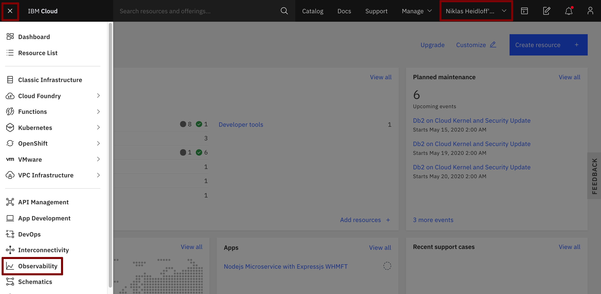

Create an 'IBM Log Analysis with LogDNA' instance by clicking on 'Create new'.

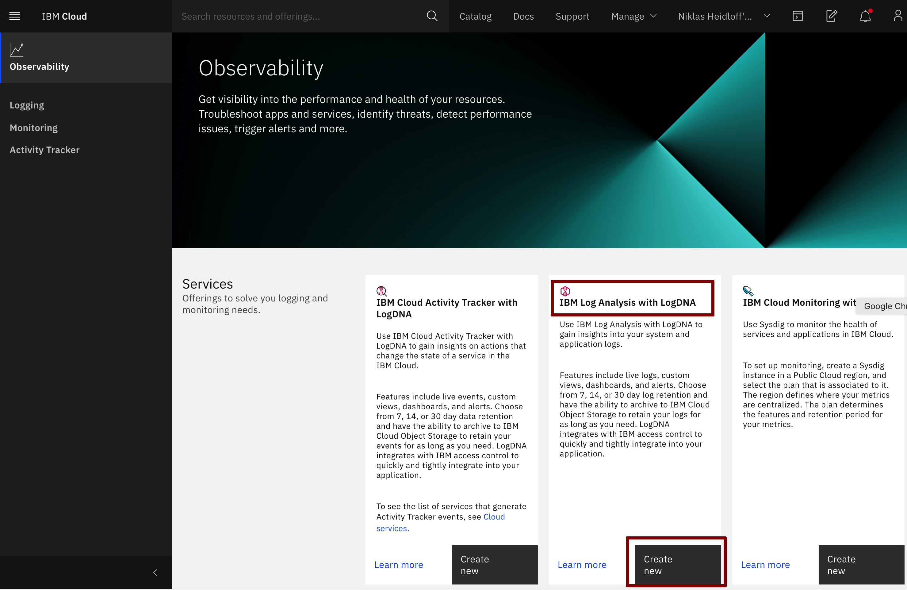

On the 'Create' tab leave all defaults. All you have to do is to create the big blue 'Create' button.

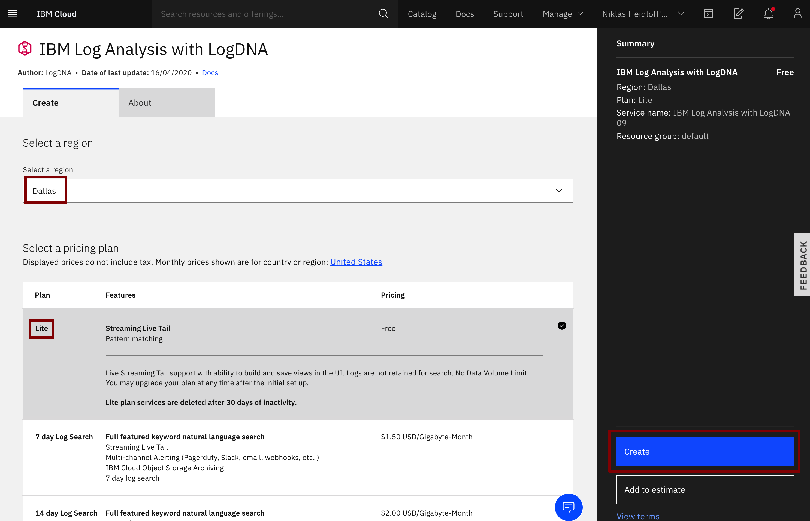

### Step 2: Configure LogDNA

Select 'Edit log sources'.

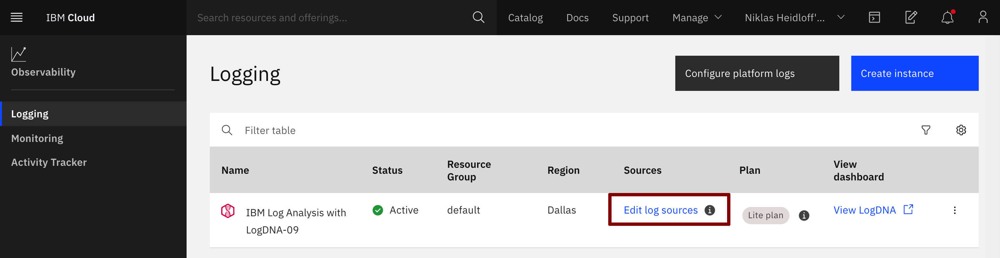

Select the 'OpenShift' tab. Copy, paste, and execute the commands into your IBM Cloud Shell:

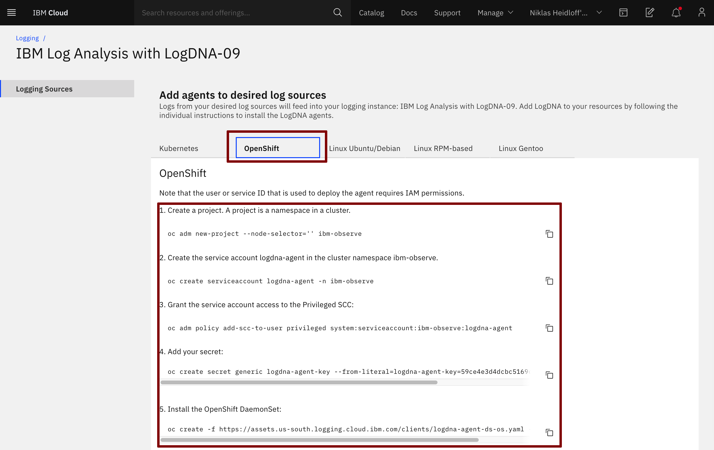


In the Cloud Shell check that the logging agent is running.

```
$ oc get all -n ibm-observe
```

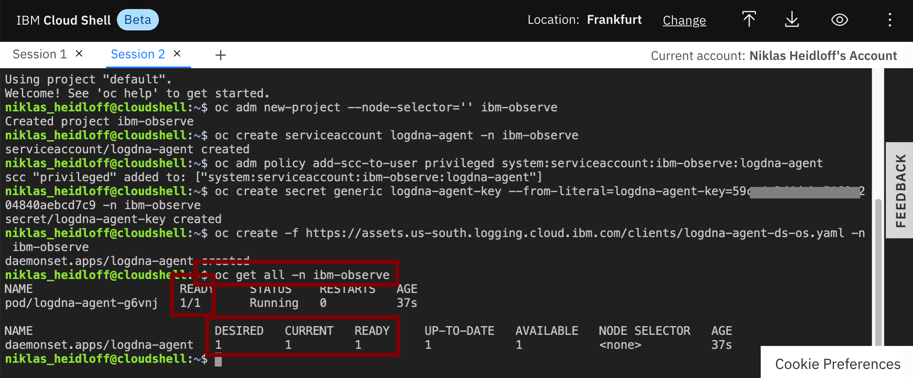

### Step 3: Use LogDNA

Go back to the [IBM Cloud dashboard](https://cloud.ibm.com/). Make sure you are using your own account. From the 'burger menu' in the upper left corner select `'Observability'` and then 'Logging'.

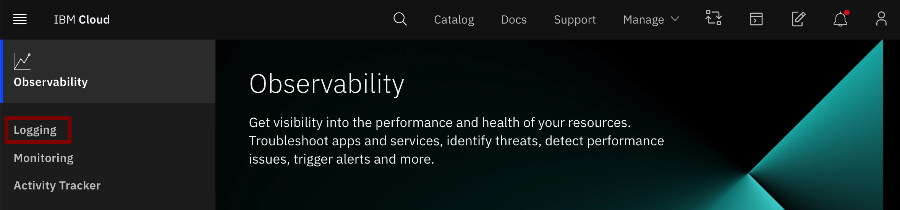

Click 'View LogDNA'.

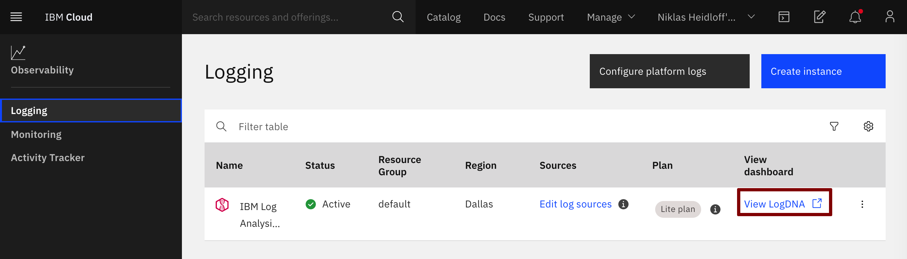

In Exercise 1 [Deploying Sample Application](../exercise-05/README.md) you have deployed an instance of the 'Articles' service called 'articles-reactive'. We will check LogDNA for output from this instance. Execute the following commands in the Cloud Shell:

```
oc project cloud-native-starter
watch curl -X GET "http://$(oc get route articles-reactive -o jsonpath={.spec.host})/v2/articles?amount=10" -H "accept: application/json"  
```
   
The `"watch"` command will constantly (every 2 seconds) request articles information.

Refresh your browser tab with the LogDNA dashboard and insert in the search field `"getArticlesReactive"`.

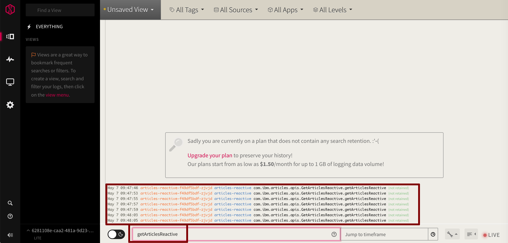

Note: If you don't see "getArticlesReactive" wait a little longer (with the free/lite version it can take several minutes before data shows up), then refresh the browser tab of the LogDNA dashboard again.

Select 'Unsaved View' and then 'Save as new/alert'.

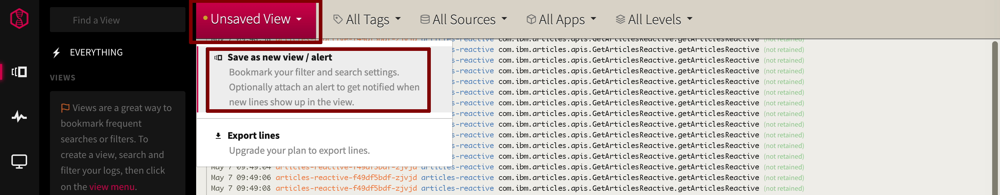

Give the view a ane and press 'Save View'.

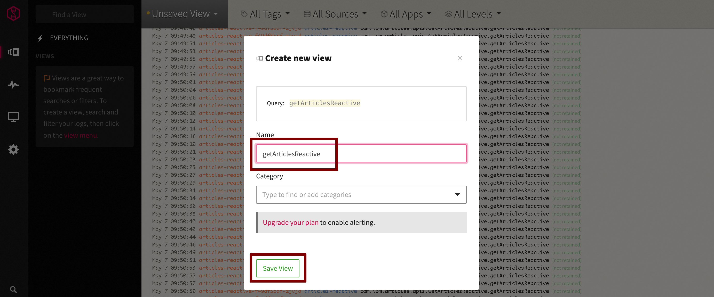

From now the new view is available under 'Views'.

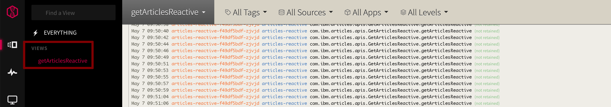

---

__Congratulations! You’ve finished the workshop!__
