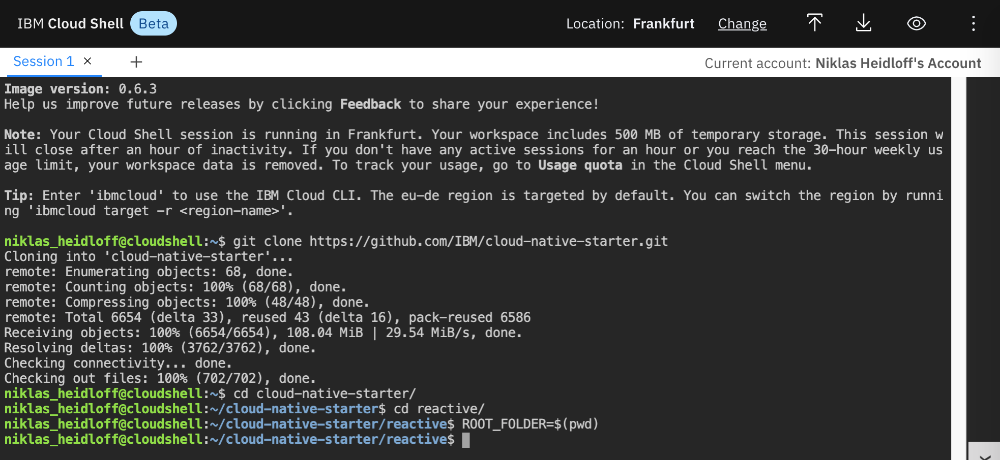
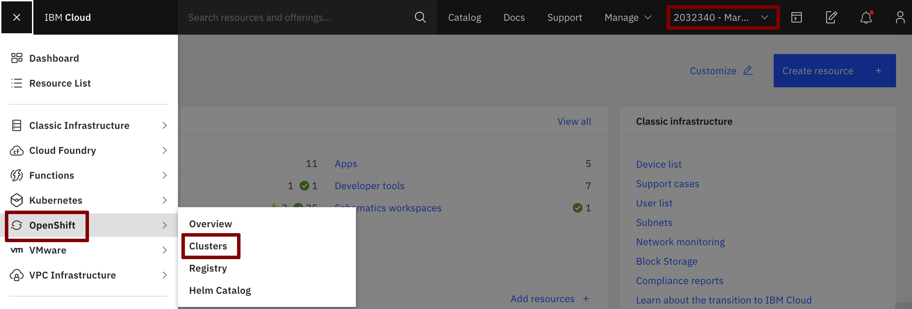

# IBM Cloud Shell

For this workshop we'll be using the IBM Cloud Shell. The IBM Cloud Shell is a cloud-based shell workspace that you can access through your browser. It's preconfigured with the full IBM Cloud CLI and other 3rd party CLIs like OpenShift's `oc`, Helm's `helm` and Kubernetes' `kubectl`.

### Step 1: Set up Terminal

When using OpenShift on IBM Cloud no client side setup is required for this workshop. Instead we will use the IBM Cloud Shell (Beta) which comes with all necessary CLIs (command line tools).

In your browser, login to the [IBM Cloud](https://cloud.ibm.com) Dashboard. Make sure you select your own account in the account list at the top, then click on the IBM Cloud Shell icon.


Note: Your workspace includes 500 MB of temporary storage. This session will close after an hour of inactivity. If you don't have any active sessions for an hour or you reach the 30-hour weekly usage limit, your workspace data is removed.

This is what you should see:


When using OpenShift locally, you need a local terminal and the following tools: 

* [git](https://git-scm.com/book/en/v2/Getting-Started-Installing-Git)
* [curl](https://curl.haxx.se/download.html)
* [oc](https://docs.openshift.com/container-platform/4.3/welcome/index.html)
* [mvn](https://maven.apache.org/ref/3.6.3/maven-embedder/cli.html)
* Java 9 or higher

### Step 2: Get the Code

In the IBM Cloud Shell execute the following command:

```
$ git clone https://github.com/IBM/cloud-native-starter.git
```



### Step 3. Get Access to OpenShift

Open the [IBM Cloud Dashboard](https://cloud.ibm.com). In the row at the top switch from your **own** account to the **IBM account** given to you by the instructor from the pulldown in the uper right corner.

The select 'OpenShift' in the burger menu in the upper left corner followed by 'Clusters'.



Click on your cluster.


Open the OpenShift web console.


From the dropdown menu in the upper right of the page, click 'Copy Login Command'. 


Click on 'Display Token', then copy and paste the command 'Log in with this token' into your terminal in the IBM Cloud Shell.


Login to OpenShift in IBM Cloud Shell

```
$ oc login https://c1XX-XX-X.containers.cloud.ibm.com:XXXXX --token=xxxxxx'
```


